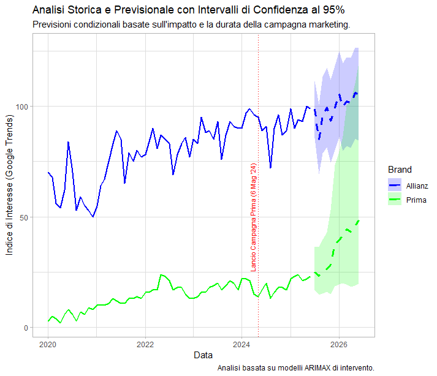

# Analisi Competitiva e Previsionale nel Mercato Assicurativo Digitale
**Studio sull'Impatto della Campagna Marketing di Prima Assicurazioni su Google Trends**
#
## Sommario

Questo progetto realizza un'analisi di mercato nel settore assicurativo italiano, quantificando l'impatto della massiccia campagna marketing di Prima Assicurazioni (Maggio 2024) sull'interesse di ricerca online. Utilizzando dati da Google Trends e modelli di intervento **ARIMAX**, lo studio misura sia l'effetto sul brand stesso (Prima) sia sul leader di mercato (Allianz), concludendo con una previsione comparativa delle traiettorie future dei due brand.

## Risultati Chiave 

- **Impatto Inatteso su Prima:** La campagna ha avuto un impatto statisticamente significativo ma **negativo** sulla traiettoria di crescita attesa di Prima, suggerendo un'efficienza inferiore rispetto al momentum organico pre-esistente (impatto stimato: -27%).

- **Resilienza del Leader di Mercato:** L'analisi non ha rilevato un impatto statisticamente significativo sull'interesse di ricerca per Allianz, indicando una forte resilienza del brand incumbent di fronte a massicci investimenti pubblicitari del competitor.

- **Dinamiche Competitive Future:** I modelli previsionali indicano una crescita accelerata per Prima Assicurazioni, con il potenziale di **ridurre significativamente il divario** di interesse con Allianz nei prossimi 12 mesi.



## Tech Stack
L'analisi è stata condotta interamente in R. Le principali librerie utilizzate sono:

- tidyverse: Per la manipolazione dei dati (dplyr) e la creazione di grafici (ggplot2).
- forecast: Per la stima e la previsione con modelli ARIMA e ARIMAX (Arima, auto.arima, forecast).
- zoo: Per la gestione e la manipolazione delle serie temporali e delle date.
- tseries: Per l'esecuzione dei test di stazionarietà (Augmented Dickey-Fuller test).
- knitr: Per la generazione del report finale in formato PDF tramite R Markdown.

## Struttura del Repository

Il progetto è organizzato secondo una struttura standard per garantire chiarezza e riproducibilità.

```
/allianz_vs_prima/
|
|-- README.md                # File di presentazione del progetto
|-- .gitignore               # Specifica i file temporanei da ignorare
|
|-- /Data/
|   |-- multiTimeline.csv    # Dati grezzi utilizzati
|
|-- /Report/
|   |-- Analisi-di-Mercato-e-Stima-d-Impatto.pdf           # Report finale in formato PDF, pronto per la lettura
|   |-- Analisi di Mercato e Stima d'Impatto.Rmd           # Codice sorgente R Markdown con l'analisi completa
|-- /plots/
|   |-- previsioni_finali.png  # Grafico principale generato
```

## Come Eseguire l'Analisi

Per riprodurre l'analisi e generare il report finale:

1. **Prerequisiti:** Assicurarsi di avere installato R e RStudio
2. **Clonare il Rpository:** Scaricare o clonare questo repository sul proprio computer
3. **Installare le Librerie:** Aprire RStudio ed eseguire il seguente comando per installare tutte le librerie necessarie: ``` install.packages(c("tidyverse", "forecast", "zoo", "tseries", "knitr")) ```
4. **Eseguire il Report:** Aprire il file report.Rmd in RStudio. Cliccare il pulsante "Knit" sulla barra degli strumenti. Questo eseguirà l'intero script, conducendo l'analisi da zero e generando il file report.pdf aggiornato all'interno della cartella /report/.
